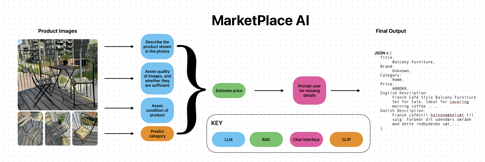

# Marketplace AI



## Preparation
Before diving into the project, you might find it helpful to familiarize yourself with the following resources:
- **Udemy Course**: [LangChain: Building Chatbots and AI Assistants](https://www.udemy.com/course/langchain/learn/lecture/43404740#overview)
- **YouTube Course**: [AI & Machine Learning Playlist](https://www.youtube.com/playlist?list=PLfaIDFEXuae2LXbO1_PKyVJiQ23ZztA0x)

## Specification 

**Expected JSON Output**:

```json
{
  "estimated_price": "value",
  "condition": "value",
  "brand_manufacturer": "value",
  "model": "value",
  "product_tags": ["value1", "value2"],
  "product_category": "value",
  "color": "value",
  "receipt": "yes/no"
}
```

### 0. User Inputs

The user will need to provide the following details:

- **Currency**: The currency for price estimation.
- **Languages/Region**: Specify the language and region for localization.
- **Urgency**: How quickly the listing needs to be posted.
- **Tone of Voice**: Options include formal, informal, concise, or verbose.
- **API Key**: Required for interacting with external services.
- **Model Selection**: Choose the AI model to be used.
- **Profile Info**: Additional information such as location, etc.

### 1. Image Submission

The app will receive images of the object intended for sale.

### 2. Product Identification

The app identifies the product in the submitted images.

### 3. JSON Field Relevance

Determine which fields in the JSON are relevant based on the identified product.

### 4. Request Missing Information

If any information is missing, the app should prompt the user for additional details, potentially via a chat interface.

### 5. Price Estimation

- Scraping Facebook Marketplace: For scraping needs, refer to this script.

### 6. User Confirmation

Present the listing to the user for confirmation and edits if necessary.

### 7. Post Listing to Server

Once confirmed, the listing will be posted through the API to the server. More details on the API can be found here.

### 8. iPhone App Development

- Learn Swift to create an iPhone app version of the marketplace.

## Research Questions

These are some key questions to guide the development process:

- Should we provide all pictures at once or one by one?
- Should we fine-tune the model? What could be gained?
- For price estimation, should we:
    1. Use a database for lookups?
    2. Perform online searches?
    3. Use the base model for predictions?
- Should the price estimator be region-aware? Is urgency relevant?
- Should the app request more or better quality pictures?
- Should we use a multi-agent or single-agent approach?
- Is Facebook Marketplace the only relevant platform? What other platforms offer API POST capabilities?
- How can we effectively perform A/B testing for different prompts?

## Implementation Strategy

> Day 0

```markdown
- Introduction to LangChain
- Introduction to RAG and Agent-Based Systems
- Idea Introduction
- Specification Development
- Implementation of CLIP Classifier with a Streamlit frontend.
```

>Day 1

```markdown
- Build a Simple Streamlit App with the following features:
- Dropzone for images
- Image submission to the model
- Receive and display the product description
- Visualize the Specification as a flowchart.
```
